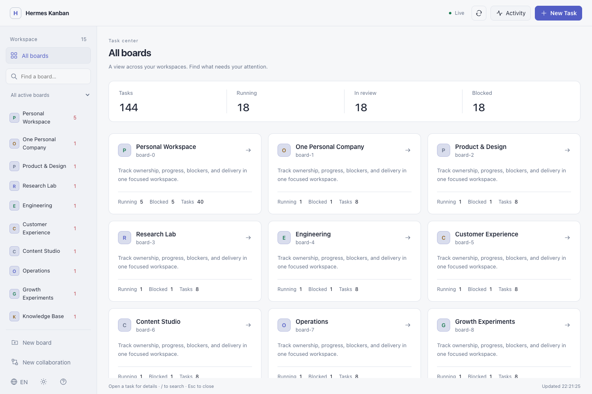
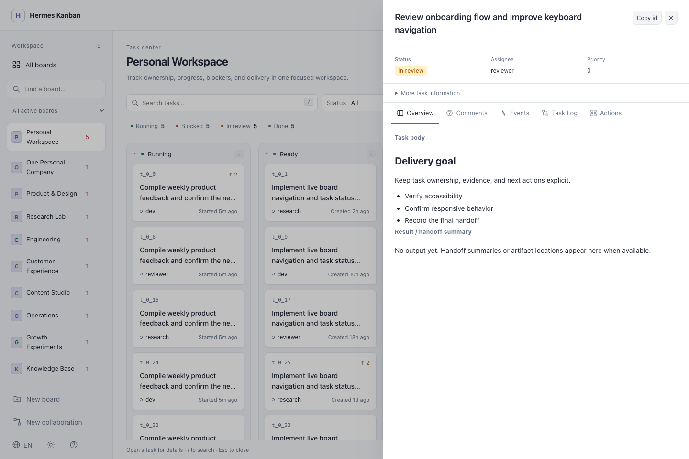
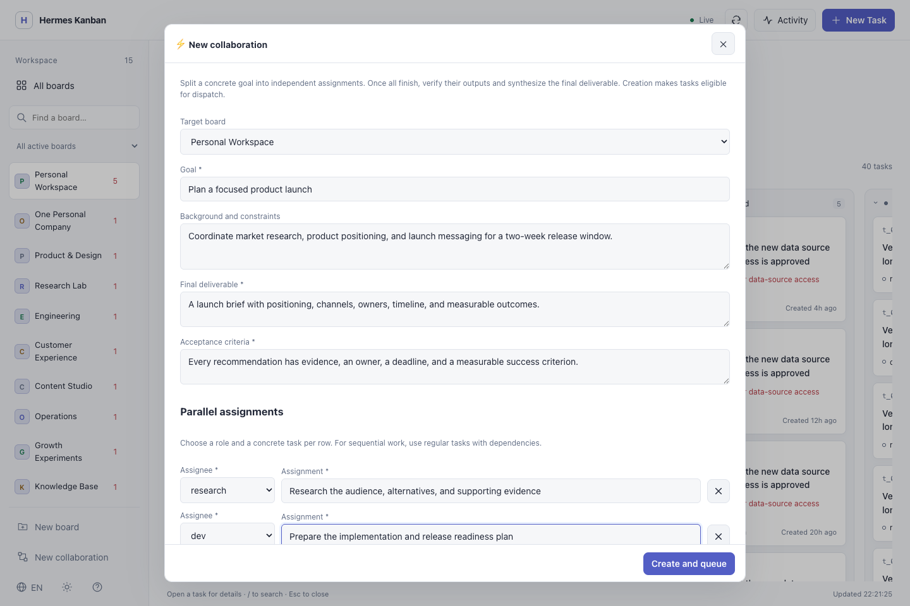

# Hermes Kanban Dashboard

[](https://github.com/xiaoxipanda/hermes-kanban-dashboard/actions/workflows/ci.yml)
[](LICENSE)
[](https://www.python.org/)
[](docs/DEPLOY.md)

A lightweight, generic, real-time dashboard on top of the **Hermes** kanban CLI.
No direct SQLite access, no hard-coded boards or assignees — every read and
write goes through `hermes kanban … --json` as a subprocess. Drop it on any
host that already has Hermes installed.

[中文说明](#中文) · [English](#english) · [Deployment](docs/DEPLOY.md) ·
[Changelog](CHANGELOG.md) · [Contributing](CONTRIBUTING.md) ·
[Security](SECURITY.md)

<p align="center">
  
</p>

---

## English

### What it does

- **Scalable board navigation.** Discovers boards dynamically
  (`hermes kanban boards list --all --json`), with search, favorites, archived
  boards, an overview, and a focused board view.
- **Status columns + flash animation.** Cards grouped by
  `running / ready / review / blocked / todo / scheduled / triage / done /
  archived`. Cards flash when their status changes.
- **Instant filtering.** Text search on `id / title / body / assignee`,
  status and assignee drop-downs, an "include archived" toggle, removable filter
  chips, and per-board filter/scroll memory.
- **Rich drawer.** Markdown-rendered body, latest 30 comments, 50 lifecycle
  events, and a tail of the worker log at `~/.hermes/kanban/logs/<id>.log`.
- **Full write surface.** `comment`, `block`, `unblock`, `request-review`
  (with `--reviewer`), `archive`, `reassign` (with `--reclaim`), plus a
  board-creation form and dedicated forms for `kanban create` (15+ fields) and `kanban swarm`
  (parallel workers + verifier + synthesizer).
- **SSE live stream.** Every 2 s (`DASHBOARD_POLL`) the server diffs selected
  board snapshots. Overview fetches summaries only; the optional activity
  panel enables a live tail of `~/.hermes/logs/gateway.log`.
- **Responsive workspace.** Neutral light/dark themes, English / 中文,
  mobile navigation, consistent icons, keyboard controls, and reduced motion.
  Task updates appear as a notice without interrupting the open drawer.
- **Zero coupling.** Does not modify Hermes core, does not touch
  `kanban.db`, and has no database of its own. UI preferences stay in the browser.

### Requirements

- Hermes with the `kanban` subcommand (recent build; the dashboard uses
  `boards list --all --json`, `assignees --json`, and `list --json`).
- Python **3.10+**.
- A browser (Chrome / Edge / Firefox / Safari modern enough for `<dialog>`
  and ES2020).

### Quick start

```sh
git clone https://github.com/xiaoxipanda/hermes-kanban-dashboard.git
cd hermes-kanban-dashboard

# Create .venv and install dependencies (and optionally the launchd agent).
./install.sh              # just install deps
./install.sh --launchd    # macOS: also drop a user launchd agent

# Or run it manually:
./launch.sh
```

Open <http://127.0.0.1:8788>.

### Configuration

All settings are environment variables; see [`.env.example`](.env.example):

| Variable | Default | Purpose |
|---|---|---|
| `HERMES_BIN` | `$HOME/.hermes/hermes-agent/.hermes/bin/hermes` | path to the `hermes` binary |
| `HERMES_HOME` | `$HOME/.hermes` | hermes data directory (holds `kanban.db`, `logs/`, `kanban/logs/`) |
| `DASHBOARD_HOST` | `127.0.0.1` | bind host |
| `DASHBOARD_PORT` | `8788` | bind port |
| `DASHBOARD_TOKEN` | *(unset)* | if set, every `/api/*` request (incl. SSE) must send `Authorization: Bearer <token>` or `?token=…` |
| `DASHBOARD_POLL` | `2.0` | SSE poll interval in seconds |

### HTTP API

| Method | Path | Purpose |
|---|---|---|
| `GET` | `/healthz` | liveness, no auth required |
| `GET` | `/api/config` | boards + assignees + poll config |
| `GET` | `/api/boards` | board catalog, including archived boards |
| `POST` | `/api/boards` | create a native board and its isolated task store |
| `GET` | `/api/assignees` | assignee list |
| `GET` | `/api/boards/{board}/tasks?include_archived=0` | task list, newest-updated first |
| `GET` | `/api/tasks/{board}/{id}` | task + comments + events + runs |
| `GET` | `/api/tasks/{board}/{id}/log?lines=400` | tail worker log |
| `GET` | `/api/swarms/{board}/{root_id}` | native topology, subtask progress, verification gate and final result |
| `GET` | `/api/events?boards=a,b&include_archived=0&gateway=0` | SSE; empty `boards=` means summaries only; omitted `boards` means all boards |
| `POST` | `/api/tasks/{board}/{id}/comment` | `{text}` |
| `POST` | `/api/tasks/{board}/{id}/block` | `{reason?}` |
| `POST` | `/api/tasks/{board}/{id}/unblock` | `{reason?}` |
| `POST` | `/api/tasks/{board}/{id}/request-review` | `{summary?, reviewer?}` |
| `POST` | `/api/tasks/{board}/{id}/archive` | `{reason?}` |
| `POST` | `/api/tasks/{board}/{id}/reassign` | `{assignee, reclaim?, reason?}` |
| `POST` | `/api/boards/{board}/create` | full `kanban create` payload |
| `POST` | `/api/boards/{board}/swarm` | parallel workers + verifier + synthesizer |

### Development

```sh
python -m venv .venv
.venv/bin/pip install -r requirements.txt
.venv/bin/python server.py                      # auto-reload with uvicorn --reload if you prefer
```

CI runs Python compilation, API regression tests, syntax checks for all
frontend JavaScript files, and `docker build`.

Optional browser checks use synthetic data and never invoke Hermes:

```sh
pip install playwright
CHROME_PATH=/path/to/chrome python tests/ui_smoke.py
```

The suite covers 16 boards, filters, live updates, drafts, form submission,
and desktop/mobile layouts. Screenshots default to `/tmp/hermes-ui-screenshots`.
See [CONTRIBUTING.md](CONTRIBUTING.md) for scope and PR expectations.

### Deployment

See **[docs/DEPLOY.md](docs/DEPLOY.md)** for macOS launchd, Linux systemd,
Docker, Tailscale, and reverse-proxy recipes.

### Screenshots

Screenshots use synthetic fixture data. No production tasks, paths, or
identities are included.

| Task details | Collaboration workflow |
|---|---|
|  |  |

### License

MIT — see [LICENSE](LICENSE).

---

## 中文

### 简介

一个独立的 **Hermes** 看板实时 Dashboard。所有读写都走
`hermes kanban … --json` 子进程,不直接读写 SQLite,不改 Hermes 核心,
不硬编码任何看板名、assignee 或工作流。可部署在任何装了 Hermes 的机器上,
启动时从 CLI 动态发现看板列表。

### 主要功能

- **多看板导航**:动态发现看板，支持搜索、收藏、归档入口与全部看板总览；
  选择看板后，在主区集中查看和处理任务。
- **状态分组 + 变更闪烁**:按 `running / ready / review / blocked / todo /
  scheduled / triage / done / archived` 分列,状态变化时卡片闪烁。
- **即时过滤**:关键词(id/title/body/assignee)+ 状态 + assignee 下拉
  + 含归档开关；筛选条件可逐项清除，切板时记住筛选与滚动位置。
- **抽屉详情**:Markdown 渲染 body、最近 30 条评论、50 条生命周期事件、
  以及 `~/.hermes/kanban/logs/<id>.log` 的实时 tail。
- **全套写操作**:`comment` / `block` / `unblock` / `request-review` /
  `archive` / `reassign`,外加"新建看板"、"新建任务"(15+ 参数) 和"新建协作任务"
  (逐项分工 → 审核 → 汇总，含流程预览和进度追踪)弹窗。
- **SSE 实时流**:每 2s (`DASHBOARD_POLL`) 更新当前选中的看板，
  总览只加载摘要；展开活动面板后才订阅 Gateway 日志。
- **外观与多语**:中性色深浅主题、中英双语、窄屏侧栏、统一图标、
  键盘操作与减少动态效果支持；任务更新提示不会打断详情阅读。
- **零耦合**:不修改 Hermes 核心，不碰 `kanban.db`，无独立数据库；
  界面偏好保存在浏览器。

### 环境需求

- 装了 Hermes 且带 `kanban` 子命令的机器(需要支持 `boards list --all --json` /
  `assignees --json` / `list --json`)。
- Python **3.10 或更高**。
- 现代浏览器(支持 `<dialog>` 与 ES2020,Chrome / Edge / Firefox / Safari
  都可)。

### 快速开始

```sh
git clone https://github.com/xiaoxipanda/hermes-kanban-dashboard.git
cd hermes-kanban-dashboard

# 创建 .venv 并安装依赖(可选同时注册 launchd 自启动)
./install.sh              # 只装依赖
./install.sh --launchd    # macOS: 另外写一份用户级 launchd agent

# 或者手动前台跑:
./launch.sh
```

访问 <http://127.0.0.1:8788>。

### 配置

所有配置都是环境变量,见 [`.env.example`](.env.example):

| 变量 | 默认 | 作用 |
|---|---|---|
| `HERMES_BIN` | `$HOME/.hermes/hermes-agent/.hermes/bin/hermes` | hermes 可执行路径 |
| `HERMES_HOME` | `$HOME/.hermes` | hermes 数据目录 |
| `DASHBOARD_HOST` | `127.0.0.1` | 绑定地址 |
| `DASHBOARD_PORT` | `8788` | 绑定端口 |
| `DASHBOARD_TOKEN` | *(未设)* | 设置后所有 `/api/*`(含 SSE)需带 token |
| `DASHBOARD_POLL` | `2.0` | SSE 轮询间隔(秒) |

### 协作任务的使用

选择「新建协作任务」，填写目标、交付物和验收标准，再逐行指定负责人和
可独立执行的分工。指定审核人与汇总人，确认流程预览后创建。
此功能使用原生 `hermes kanban swarm --worker PROFILE:TITLE --verifier PROFILE
--synthesizer PROFILE --json`，需要安装版本支持这些参数。

创建后会进入原生调度队列；该看板需开启调度且有可用并发名额。
执行分工全部完成后进入审核，再进入汇总。顺序依赖任务应通过普通任务的
父任务字段建模，不应填写为并行分工。

页面会自动打开协作进度，每 10 秒刷新。之后可从看板上方的协作入口，
或任一成员任务详情中的「查看协作进度」重新打开。
主卡用于共享记录，创建时即为完成状态，不能代表整体完成。
只有执行、审核、汇总子任务全部完成且最近审核记录带 `gate=pass`，
进度页才显示整体完成。原生依赖按任务状态解锁；审核内容仍由审核角色负责，
页面不会代替审核人判定业务质量。

遇到阻塞，打开对应任务查看日志与评论，补齐资料或权限后解除阻塞。
最终结果在进度页或汇总任务的「执行结果 / 交接摘要」查看；
实际文件仍保存在任务指定的工作目录。创建接口错误时保留表单重试，
相同内容会使用同一幂等键，避免重复建卡。

### 部署

参见 **[docs/DEPLOY.md](docs/DEPLOY.md)**,涵盖 macOS launchd、Linux
systemd、Docker、Tailscale、反向代理等场景。

### 开源协议

MIT,见 [LICENSE](LICENSE)。
